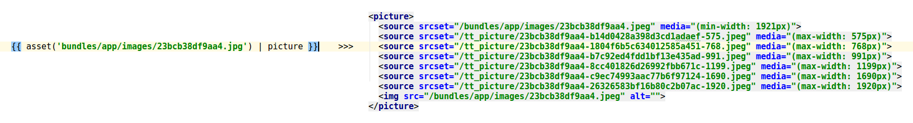

# TomAtom/PictureBundle



### Symfony Bundle for easy &lt;picture&gt;s :)

> define breakpoints and use your assets as picture sources, without annoying image conversions and long code blocks

#### Dependencies:

* `vipsthumbnail` from [libvips](https://jcupitt.github.io/libvips/)

* `symfony/framework-standard-edition ">=2.8|~3.3"`

### Installation:

* you need `vipsthumbnail` !, (install by `sudo apt install libvips-tools`, or you can [compile your own or download here](https://jcupitt.github.io/libvips/))

* create project with Symfony framework

* composer require tomatom/picture-bundle "1.3"

* add bundle to __AppKernel.php:__
```php
new TomAtom\PictureBundle\TomAtomPictureBundle(),
```
* update db schema, install assets and clear cache ... and __it's done!__

* __optionally__ add parameters to __parameters.yml(.dist)__ (define your own breakpoints etc.):
```yaml
# these are defaults
parameters:
    tt_picture_breakpoints: [575, 768, 991, 1199, 1690, 1920]
    tt_picture_converted_dir: '%kernel.project_dir%/web/tt_picture'
    tt_picture_jpeg_quality: 65
```

### Usage:

* in template, call (jpg, png and gif are supported):
```twig
{# as function #}
{{ picture(asset('path/to/asset.jpg')) }}

{# as filter #}
{{ asset('path/to/asset.jpg') | picture }}

```
> __&lt;picture&gt;__ is generated and image is converted on first render

* you can define custom breakpoints and/or jpeg quality for each image, when needed:
```twig
{# as function with custom breakpoints defined per image #}
{{ picture(asset('path/to/asset.jpg'), [300, 600, 1200]) }}

{# as function with custom jpeg quality defined per image #}
{{ picture(asset('path/to/asset.jpg'), null, 99) }}


{# as filter with custom breakpoints defined per image #}
{{ asset('path/to/asset.jpg') | picture([300, 600, 1200]) }}

{# as filter with custom jpeg quality defined per image #}
{{ asset('path/to/asset.jpg') | picture(null, 99)) }}
```

* you can retrieve converted images in PHP code too (in case you need to serve images from API, etc.), like this:
```php
// asset url - same as in Twig template
$originalAssetUrl = $this->container->get('assets.packages')->getUrl('bundles/app/images/test.jpg');
// get PictureHelper from container
$pictureHelper = $this->container->get('tomatom_picture.util.picture_helper');

// get array of all converted images for asset
$allConveretedImages = $pictureHelper->getAllConverted($originalAssetUrl);

// or specific image for breakpoint
$convertedAssetUrl = $pictureHelper->getAssetUrl($originalAssetUrl, 1920);
$convertedFilePath = $pictureHelper->getFilePath($originalAssetUrl, 1920);
```


### Todo:

- [x] jpeg quality as param
- [x] jpeg quality as param in template
- [x] breakpoints as param in template
- [ ] cmd for batch converting
- [x] converting of images other than assets (like from 'web/uploads', etc)
- [x] helper for retrieving converted images in controller / cmd / service..
